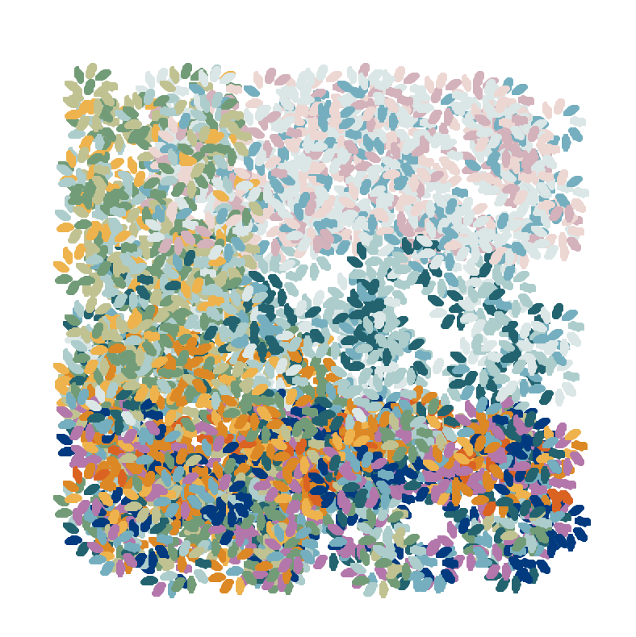

# Two Markov Chains by the Shore, Mediterranean 
Computational Creativity Assignment M3. 

## Description 

_Edmond Cross, Henri. Two Women by the Shore, Mediterranean. 1896, Oil on Canvas. The Barnes Foundation, Philadelphia._

This project generates a pointillist painting inspired by Henri Edmond Cross' "Two Women by the Shore, Mediterranean" using Markov Chains. This piece is an example of pointillism, where each brush stroke looks like a distinct point on the canvas. This project uses the Turtle library on a 300 x 300-pixel "canvas" to paint a piece that resembles Edmond Cross' original by using colors taken from the artwork and implementing pointillism by only printing distinct strokes on the screen.  

**Two Markov Chains by the Shore, Mediterranean** paints 500 circles with 10 brush strokes composing each circle. Each of these circles represents an object within Edmond Cross' painting (sky, ocean, tree, green bush, yellow bush, orange bush, or ground). Each object has a particular color profile. For example, the sky can be colored with light blue, medium blue, dusty pink, or light purple paints. The location of an object is restricted to its general location in the original painting (e.g. any sky circle can only be placed toward the top of the screen's canvas). These restrictions are hard-coded for each object. However, within each available area, the location of a circle object is randomly chosen. 

Markov Chains determine which object will be painted next and which colors in the object's color profile will be used for each paint stroke in that object. 

## Example Created by This System

_Wirsching, Olivia. Two Markov Chains by the Shore, Mediterranean (Example 4). 2023, Turtle on Screen. GitHub._

## How to set up and run the code 
1. Clone this repository
2. Navigate to the cc-m3-pointillism folder
3. Download packages random, time, turtle, and numpy in the terminal
4. Run 'python3 M3.py' in the terminal 
5. A window should appear and the painting will begin 
6. Wait a long time (around 13 minutes). The painting is ready when the black triangle stops flashing in the middle. 
7. The window will stay open for 15 seconds after the completion of the painting before closing automatically. 

## Personal Meaning 
I first saw Two Women by the Shore, Mediterranean in 2019 when visiting The Barnes Foundation in Philadelphia. I was immediately struck by the painting. The crisp imagery paired with the vibrant colors is captivating. I am not one to usually enjoy museums or buy anything from a gift store, but I loved this painting so much that I bought a scarf with the painting and a miniature painting as well. The miniature has traveled with me up to Brunswick and is hanging in my room. 

In every museum I have been to since I always look to see if any of Edmond Cross' works are hanging on the walls. Even when I do find one, they are not as magical as this one. So, when thinking of a source of inspiration for visual art, I was immediately drawn to the idea of using this painting in some way. My favorite part is the colors and the pointillism. So, I decided to have both of those features be the main focus of the project. Even though the computer version does not completely capture the beauty of the original, it captures the essence of its composition. 

## Challenges
My first challenge was understanding the Turtle Library. I struggled to understand it in Intro CS and it seems I still struggle with it now. After some trial and error, I was able to formulate two for-loops that draw circles (with no extra lines) and make sure there is even spacing between each dot in the circle. I also pushed myself by including a second Markov chain. It took some time to wrap my head around forming the second transition matrix based on the first transition matrix. Going forward, I would like to replace the circles with shapes that actually resemble their intended object (like creating a bush shape for the orange bush object).

## Is this Creative?
I believe that this system is creative. In the real world, a lot of art is inspired by past works and draws inspiration from them. Most people still classify those imitation pieces as creative, so this system would fall under the same distinction. By the definition we created in class, this system is also classified as creative. Each painting is novel given the random nature of deciding the location and colors of each circle. The paintings are also valuable because I get enjoyment from looking at them. The only concern I have with creativity is the use of Markov Chains. Is that truly a creative system if it depends on mathematical rules? However, some could argue that mathematical rules are a form of creativity because those formulas were created by humans solving problems and generating creative solutions that did not exist before.  

## Sources
Turtle Documentation: https://docs.python.org/3/library/turtle.html#turtle.towards

Keeping the Turtle Window Open: https://stackoverflow.com/questions/6234798/turtle-graphics-how-do-i-control-when-the-window-closes

Markov Musician example we did in class 

Randint: https://www.w3schools.com/python/ref_random_randint.asp

Image in Markdown: https://stackoverflow.com/questions/41604263/how-do-i-display-local-image-in-markdown

